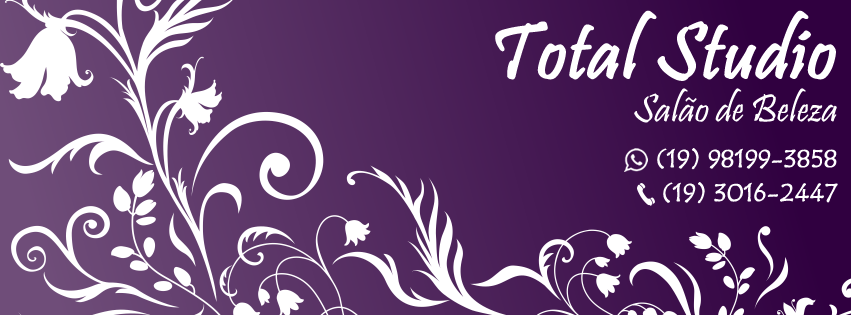
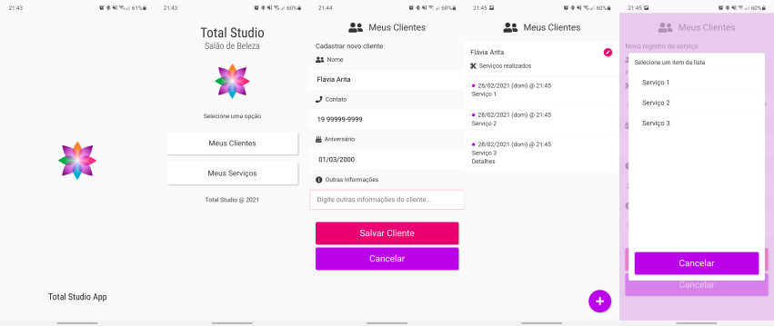

# Total Studio App

## Visite o app ou nossa página!

[Página no Facebook](https://www.facebook.com/salaototalstudio/)  
[Total Studio App (studio.hideak.com)](https://studio.hideak.com)

## O que é o Total Studio?

**Total Studio** é um salão de beleza localizado na cidade de Indaiatuba - SP, administrada pela minha mãe (Flávia Arita), que trabalha com diversos serviços como manicure, pedicure, cortes, progressivas e químicas em geral.

Devido à necessidade, o salão precisava de uma aplicação multiplataforma que atendesse algumas necessidades básicas e que funcionasse tanto em dispositivos móveis quanto em computadores. Diante disso, surgiu a ideia de criar uma Aplicação Web Progressiva (PWA).

**Total Studio App** é uma Aplicação Web Progressiva (PWA) desenvolvida para uso do próprio salão de beleza, e permite registrar dados de clientes (nome, endereço, data de aniversário, etc.) e os tipos de atendimentos que são realizados no salão ao longo do tempo, visando buscar:

- Relatórios de faturamento;
- Lembretes de aniversário;
- Lembretes de detalhes do serviço:
  - Marcas de produtos utilizado;
  - O que foi vendido;
  - Outras informações.

## Capturas de Tela (Mobile)

## Bibliotecas, Recursos e Tecnologias Envolvidas no Projeto

- Framweork: [VueJS v3](https://v3.vuejs.org/)
- Ícones: [Font Awesome](https://fontawesome.com/)
- Fontes: [Google Fonts](https://fonts.google.com/)
- Linguagens: HTML, SCSS e Typescript
- Pontos fortes do projeto:
  - **Prettier** para formatação de código;
  - **IndexedDB** para persistência de dados, **encapsulado na forma de Promises**;
  - GitHub Actions para **deploy automático** no GitHub Pages;
  - Prototipagem do layout no **Figma**
  - **Layout próprio**, sem uso de Bootstrap, Vuetify ou outras bibliotecas gráficas;
  - **Forte tipagem e modelagem de dados** com Typescript;
  - **Componentização** e **reusabilidade** de código.
